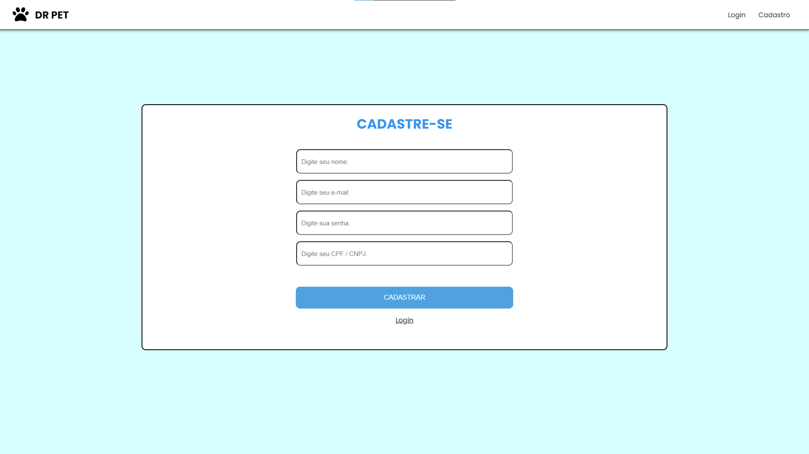
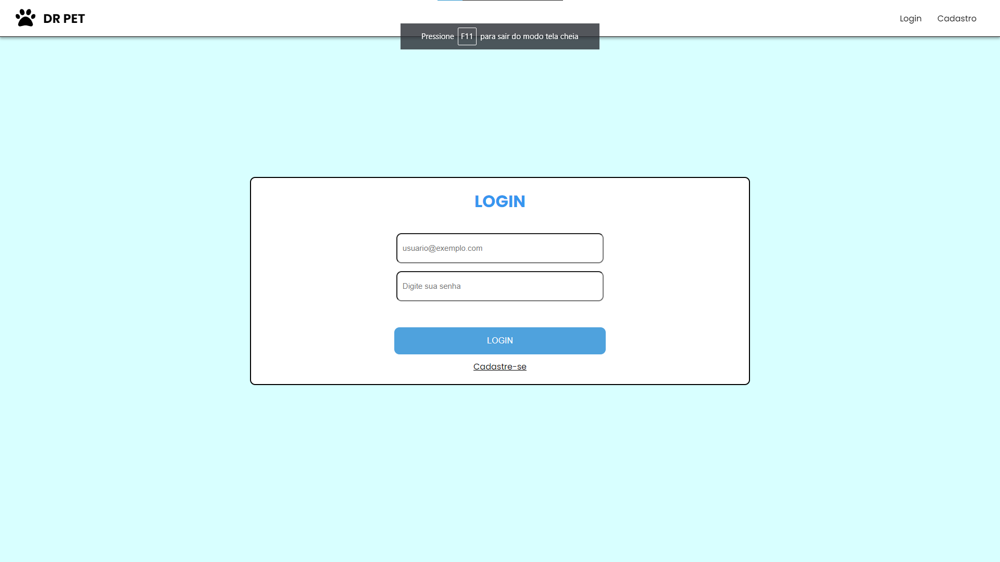
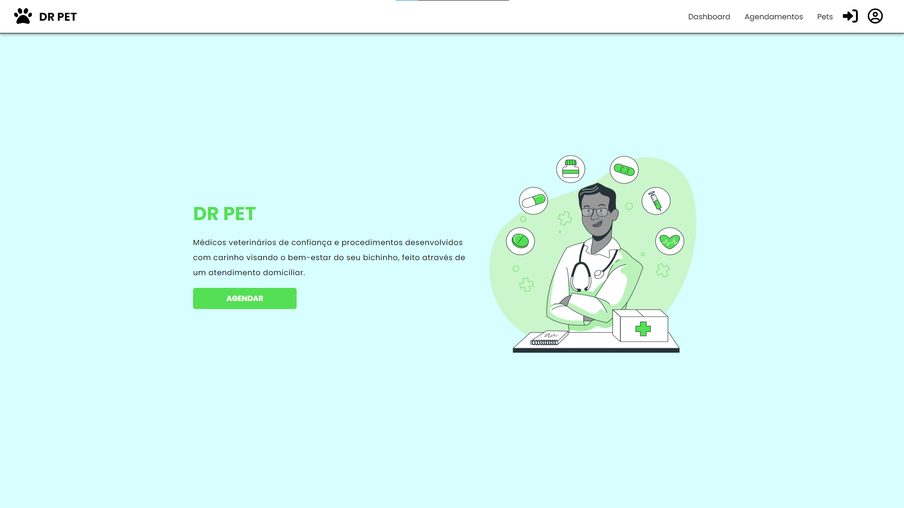
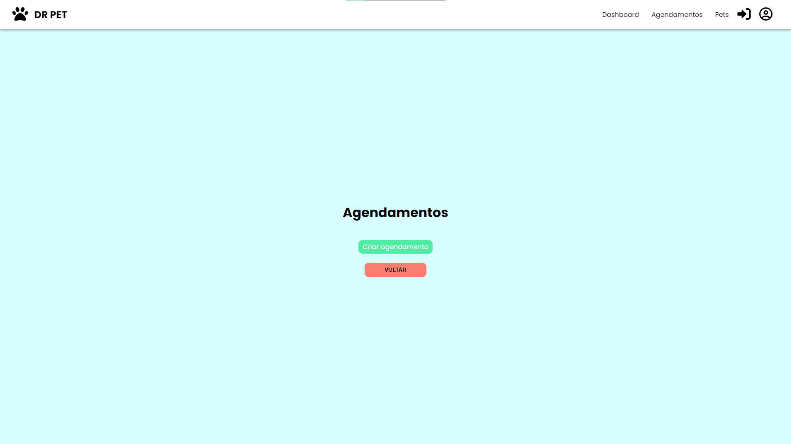
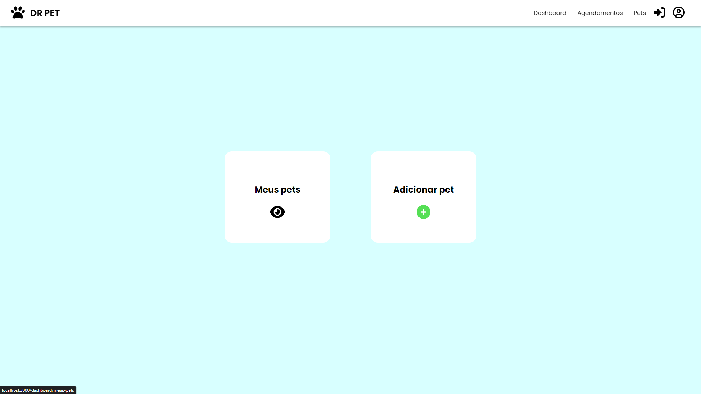
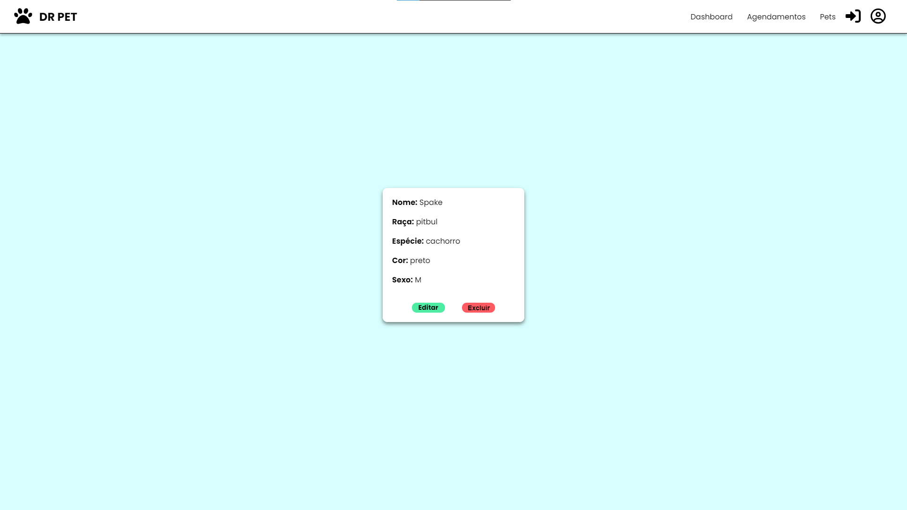
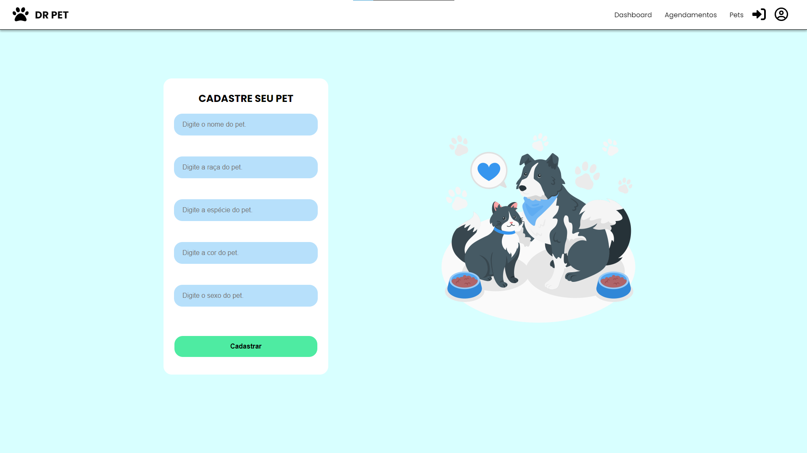
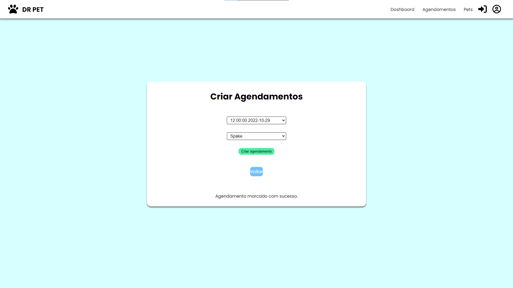

Desenvolvido com React e php 🚀

✅ Descrição
===========

Projeto PetShop solicitado por professore Atila e Gau com o objetivo de criar um site de petshop que consiga realizar: o cadastro e o login de um usuario, o cadastro do animal do usuario, e que o usuario possa agendar consultas para seu pet, e que o usuario tabem possa alterar as informações de seu cadastro. Também foi solicitado uma area para ADM que podera realizar as seguinte funções: Definir datas e horarios, Visualizar os agendamentos, Registrar os agendamentos, Cadstrar novos clientes, Listar usuarios, Listar os animais e editar.

Status do Projeto
=================

#### 🚧 React Select 🚀 Em Desenvolvimento... 🚧

Funcionalidades
===============

✅ Cadastro de usuario

✅ Cadastro de cliente

✅ Cadastro de Animais

✅ Login

Estilos
=======

[Guia de Estilos](assets/Texto do seu parágrafo.pdf)

Demonstração
============

       
